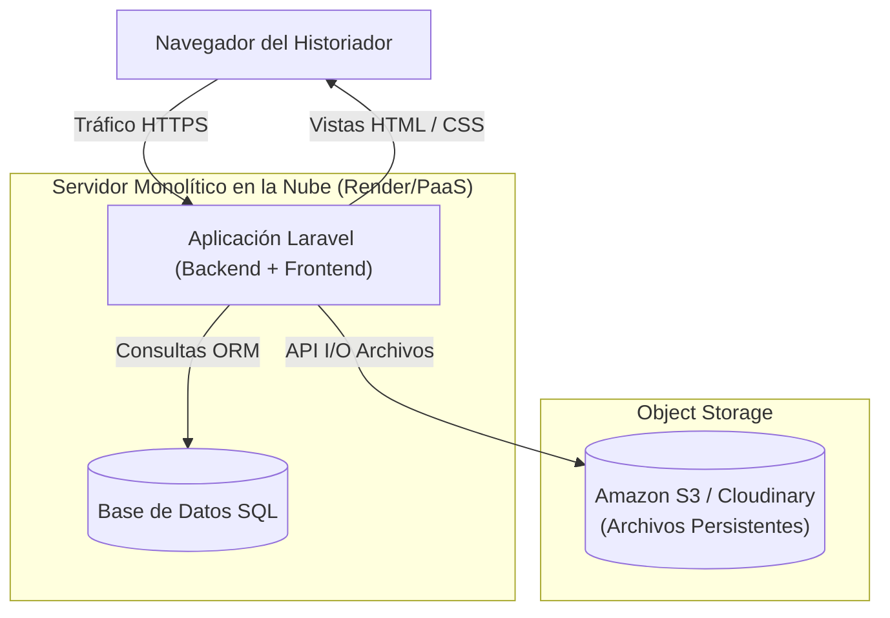
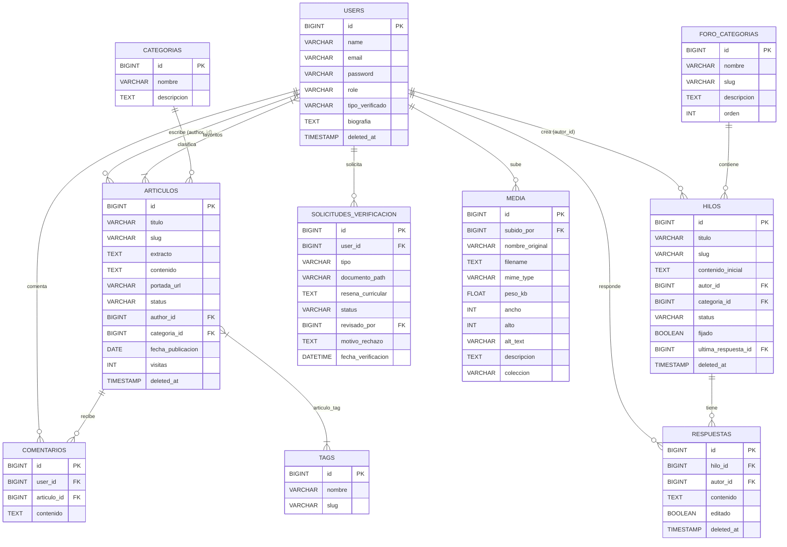
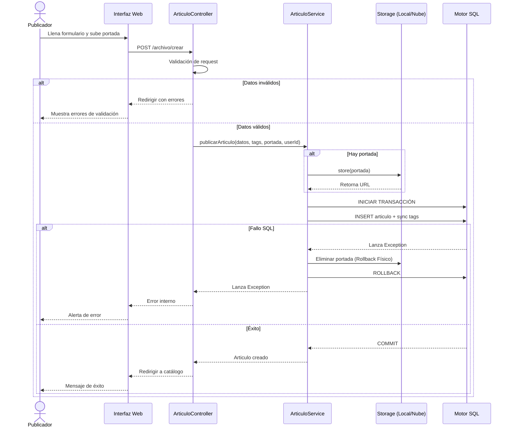
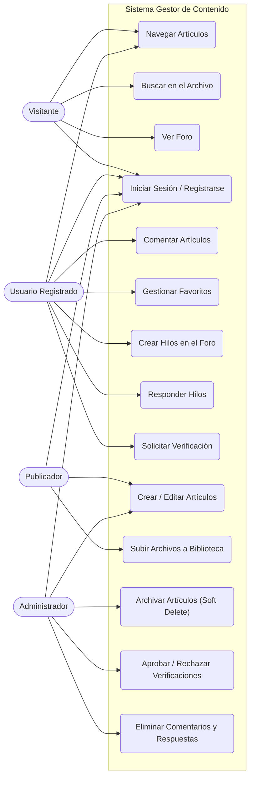

# Sistema Gestor de Contenido (SGC) - Memoria Castrense

El **SGC Memoria Castrense** es una plataforma web institucional orientada a la preservación, catalogación y discusión colaborativa de documentos históricos militares.

El proyecto garantiza la **Paridad de Entornos**, utiliza **Arquitectura Monolítica** en Laravel (PHP) con motor **PostgreSQL/SQLite** e implementa **Integración Continua (CI/CD)**. Todo el desarrollo se rige bajo estrictas políticas de [CONTRIBUTING.md](CONTRIBUTING.md).

> **Nota sobre Gestión de Proyecto:** El Plan de Acción detallado (Diagrama de Gantt y Sprints) se gestiona de forma activa en nuestro [Tablero de Notion](https://app.notion.com/p/Sistema-Gestor-de-Contenido-3922c23f08af80428d92d02acb104d20?source=copy_link).

---

## 🏗️ Arquitectura como Código (Doc-as-Code)

### 1. Diagrama de Arquitectura de Despliegue

**Justificación de la Arquitectura Monolítica vs SPA/API:** 
Se migró de una arquitectura distribuida (Vercel + Render) a un monolito puro (Render) tras evaluar la viabilidad técnica y los costos de infraestructura. El monolito reduce la latencia de red a 0ms entre el frontend (Blade) y el backend, simplifica el pipeline de CI/CD, y optimiza radicalmente el SEO (Crucial para que los artículos históricos sean indexados por motores de búsqueda), todo esto utilizando un solo servidor (Reduciendo costos en un 50%).

**Gestión de Archivos Efímeros:**
Dado que plataformas PaaS como Render utilizan sistemas de archivos efímeros que se borran con cada despliegue, la arquitectura integra un **Almacenamiento Externo de Objetos (Cloudinary / Amazon S3)**. De esta forma, las imágenes y PDFs persisten de forma segura en un Bucket en la nube, justificando que la base de datos guarde la URL completa del recurso (`filename`) en lugar de un path local.



---

### 2. Diagrama Entidad-Relación (ER)

El modelo actual refleja la arquitectura de contenido histórico, foro de discusión y verificación de usuarios.



---

### 3. Diagrama de Secuencia (Publicación de Artículos con Manejo de Archivos Huérfanos)

**Lógica de Negocio y Transacciones:**
Para evitar acoplamiento, la lógica de negocio reside en la capa `ArticuloService`. El registro en base de datos está envuelto en un bloque `DB::transaction`. Si la base de datos rechaza la inserción, el sistema captura la excepción (`catch`) y **borra el archivo del disco** automáticamente.



---

### 4. Casos de Uso del Sistema



---

## 📖 Documentación Técnica (Doc-as-Code)

La documentación de clases (PHPDoc) se genera automáticamente con **phpDocumentor**:

```bash
# Generar documentación (salida en public/docs/)
composer docs

# Servir la documentación localmente
php -S localhost:8000 -t public/docs
```

Todas las clases en `app/Http/Controllers/`, `app/Models/` y `app/Services/` incluyen PHPDoc completo.

> Proyecto académico desarrollado para la materia Implantación de Sistemas (2026). Equipo: Eduardo Rojas & Ernesto Polanco.