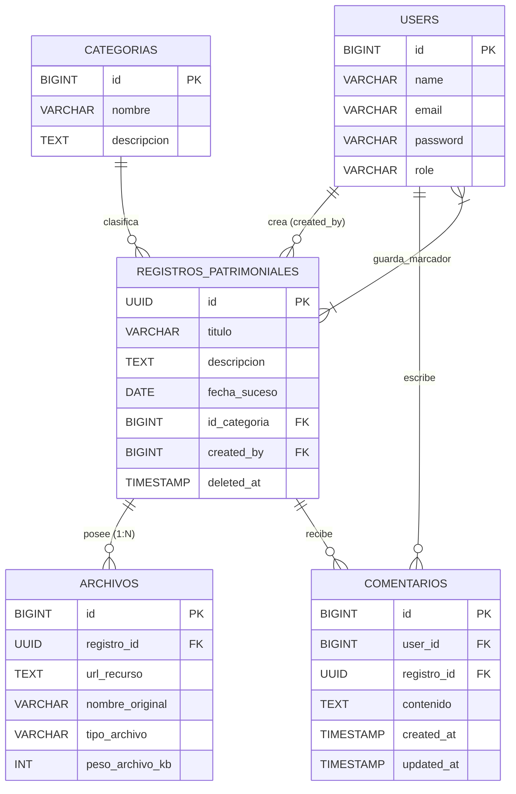
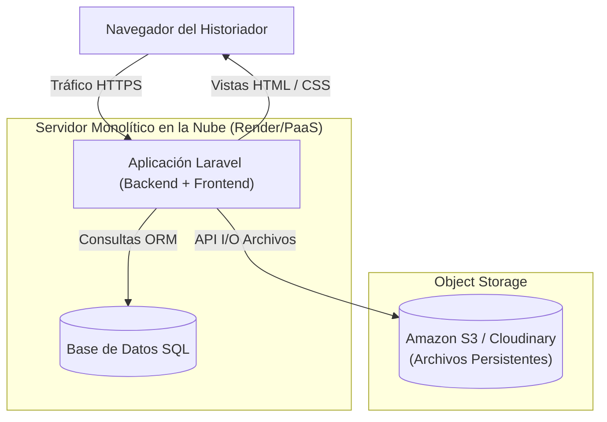
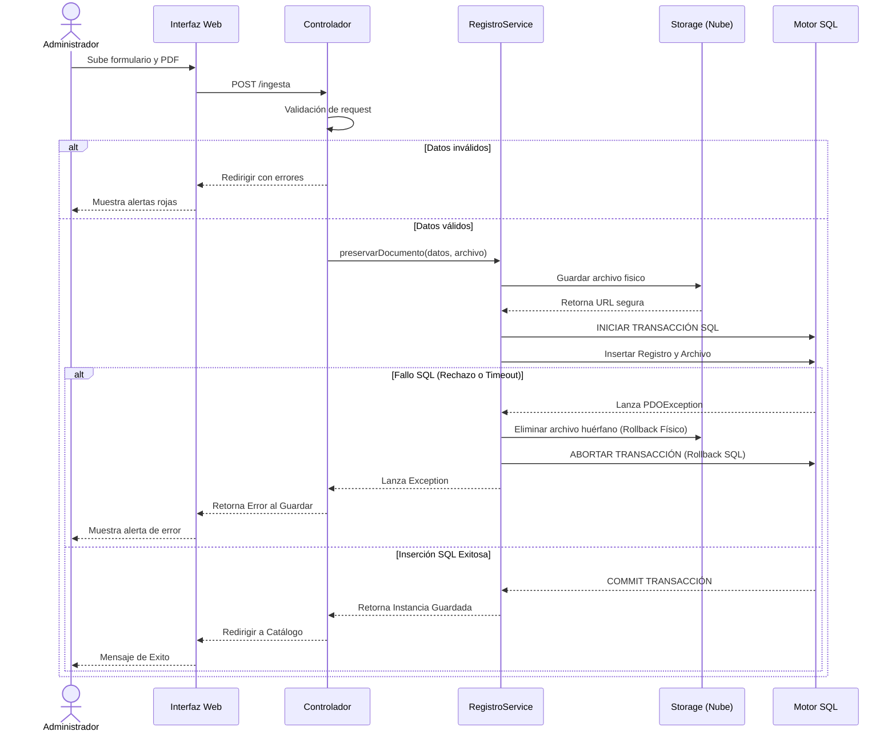
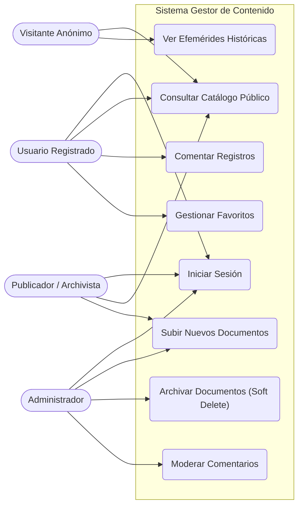

# Documentación Técnica y Metodológica - SGC Memoria Castrense

Este documento engloba la arquitectura, el análisis de requerimientos y la planificación del Sistema Gestor de Contenido (SGC) para la Preservación de la Memoria Castrense. Se atienden y subsanan todas las observaciones recibidas en la revisión del proyecto.

---

## 1. Instrumento de Elicitación (Entrevista a Informante Clave)

Para el levantamiento de información, se utilizó como instrumento la **Entrevista Semiestructurada**, aplicada al Tte. Cnel. Director del Archivo Histórico.

**Guion de Entrevista (Extracto):**
1. *¿Cómo se lleva a cabo actualmente el proceso de registro de nuevos documentos históricos?*
2. *¿Cuáles son las mayores deficiencias al intentar buscar un documento específico en sus archivos?*
3. *¿Qué roles de personal interactúan con estos documentos y qué permisos debería tener cada uno?*

**Información Obtenida (Respuestas del Informante):**
> "Actualmente todo el registro se lleva en libros contables físicos. El principal problema es el deterioro de las páginas y que, para buscar un acta de 1980, podemos tardar días leyendo tomo por tomo. Necesitamos que el sistema permita subir fotos o PDFs escaneados de estos documentos. En cuanto a roles, debe haber un Administrador que controle todo, Archivistas (Publicadores) que solo puedan subir documentos pero no borrarlos, y Usuarios que solo puedan consultar el catálogo."

---

## 2. Historias de Usuario y Reglas de Negocio

| ID | Historia de Usuario | Reglas de Negocio (RN) | Requisitos Asignados |
|----|---------------------|-------------------------|-----------------------|
| HU01 | Como **Administrador**, quiero ingresar nuevos registros patrimoniales anexando múltiples archivos (imágenes/PDF), para digitalizar el catálogo físico. | RN1: El peso máximo total por archivo es 10MB. RN2: Se debe asociar siempre a una Categoría válida. | RF01, RF02 |
| HU02 | Como **Usuario Visitante**, quiero explorar una galería pública con paginación, para encontrar actas históricas fácilmente. | RN3: El catálogo público es de solo lectura. RN4: Los registros archivados no se muestran. | RF03 |
| HU03 | Como **Usuario Autenticado**, quiero dejar comentarios en los registros y marcarlos como favoritos, para mantener mis apuntes sobre el suceso. | RN5: Un usuario no puede marcar dos veces el mismo documento. RN6: Los comentarios no pueden estar vacíos. | RF04, RF05 |

---

## 3. Matriz de Requisitos

### Funcionales (RF)
- **RF01:** El sistema debe permitir autenticación segura de usuarios y asignar roles (Administrador, Publicador, Usuario).
- **RF02:** El sistema debe permitir crear, leer, actualizar y "archivar" (borrado lógico) registros patrimoniales.
- **RF03:** El sistema debe proveer una barra de búsqueda para filtrar registros por título, descripción o categoría.
- **RF04:** El sistema debe permitir a los usuarios autenticados comentar sobre los registros.
- **RF05:** El sistema debe permitir almacenar documentos en marcadores personales.

### No Funcionales (RNF)
- **RNF01:** Tiempos de respuesta menores a 2 segundos para consultas de catálogo.
- **RNF02:** La interfaz debe ser completamente responsiva y mantener una estética institucional militar (Navy/Gold).
- **RNF03:** Contraseñas encriptadas con Bcrypt.

---

## 4. Plan de Acción y Ejecución

> **Nota Metodológica:** En respuesta a la observación del profesorado, la matriz de asignación de tareas, cronograma de Sprints y el Diagrama de Gantt han sido migrados a nuestro entorno colaborativo de **[Notion / ClickUp]**. El repositorio de código se destina exclusivamente a elementos versionables de software.

---

## 5. Estudio de Factibilidad

### Factibilidad Técnica y Operativa
- **Técnica:** El equipo domina el ecosistema PHP/Laravel y bases de datos relacionales. No se requieren licencias pagas al usar software Open Source.
- **Operativa:** El archivo cuenta con computadoras con navegadores web modernos, cubriendo el requerimiento mínimo para acceder a la plataforma web.

### Factibilidad Económica (Presupuesto Real)
| Concepto | Costo / Honorarios Estimados (USD) |
|----------|------------------------------------|
| Honorarios Desarrollo (Eduardo & Ernesto - 3 meses) | $ 4,500.00 |
| Hosting Render & PostgreSQL (Free Tier) | $ 0.00 |
| Almacenamiento S3/Cloudinary (Capa Gratuita) | $ 0.00 |
| Total del Proyecto | **$ 4,500.00** |

---

## 6. Paquete Tecnológico y Arquitectura

- **Paradigma de Programación:** Orientado a Objetos (POO) usando Patrones Repository y Service.
- **Frontend:** Laravel Blade, Tailwind CSS y Vanilla JS. (El **Monolito** se justifica para aprovechar el renderizado SSR que optimiza la indexación en buscadores SEO y reduce la latencia de red, disminuyendo costos de servidores distribuidos).
- **Backend:** PHP 8.2 con Laravel 10.
- **Base de Datos:** PostgreSQL (Capa de persistencia relacional con ORM Eloquent).
- **Almacenamiento de Archivos:** **Cloud Storage (S3/Cloudinary)**. (Se soluciona la debilidad de los *sistemas de archivos efímeros* de Render/Heroku delegando los archivos físicos a un proveedor de la nube dedicado. Esto justifica que la BD solo guarde la *URL externa* del recurso).

---

## 7. Diagrama Entidad-Relación (ER)

Se incluyó la definición física de los atributos de la tabla `COMENTARIOS`.

---

## 8. Diccionario de Datos Clave

### Tabla: `archivos`
| Atributo | Tipo | Restricción | Descripción |
|----------|------|-------------|-------------|
| id | BIGINT | PK | Auto-incremental. |
| registro_id | UUID | FK | Relación en cascada con `registros_patrimoniales`. |
| url_recurso | TEXT | NOT NULL | **Ruta externa HTTP** al Bucket S3/Cloud donde vive el archivo físico, aislándolo del disco efímero de Render. |
| nombre_original | VARCHAR(255)| NOT NULL | Nombre original del archivo (ej. `acta_1980.pdf`). |
| tipo_archivo | VARCHAR(50) | NOT NULL | MIME Type (ej. `image/jpeg`). |

---

## 9. Diagrama de Arquitectura de Despliegue

---

## 10. Diagrama de Secuencia (Ingreso y Transacciones)

Delegación de la lógica a la Capa `Service` e interceptación de errores de red (Ej. Falla SQL) realizando un "Rollback físico" del archivo para evitar huérfanos.

---

## 11. Casos de Uso

---

## 12. Retroalimentación Aplicada

En base a la auditoría técnica de los avances anteriores, se integraron las siguientes optimizaciones de grado de producción:
1. **Delegación a Storage Remoto:** Se mitigó el riesgo de pérdida de datos en sistemas PaaS adoptando discos en la nube persistentes, lo cual justifica guardar un `url_recurso` como texto.
2. **ACID Compliance y Archivos Huérfanos:** Se refactorizó el código y la documentación para envolver todo guardado en una transacción (`DB::transaction`). Si la Base de datos cae luego de guardarse el archivo físico, el patrón `try-catch` desencadena una reversión manual, borrando el PDF sobrante en el bucket S3.
3. **Capa de Servicios:** Se liberó al Controlador de responsabilidades introduciendo `RegistroPatrimonialService`, respetando los principios de SOLID.
